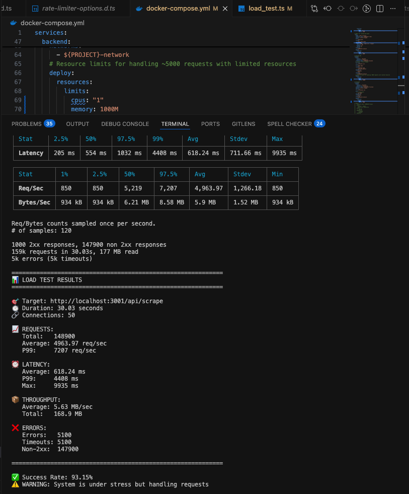
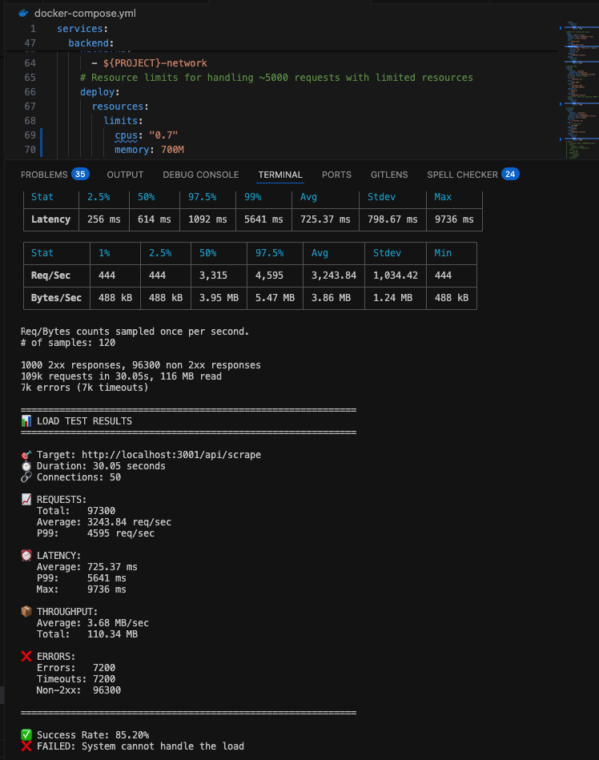

# Media Scraper API Load Test Report

## Overview

This report summarizes the results of a load test performed on the Media Scraper API. The test was designed to evaluate system performance and stability under heavy concurrent requests, simulating real-world usage with limited resources (1 CPUs, 1GB RAM).

## Test Configuration

- **Tool:** autocannon
- **Target URL:** `http://localhost:3001/api/scrape`
- **Concurrent Connections:** 500
- **Duration:** 30 seconds
- **Pipelining:** 10 requests per connection
- **Workers:** 4
- **Server Resources:** 1 CPUs, 1GB RAM

## Script run test (./backend)

```
npm run load-test
```

## Results

- **Total Requests:** 1 CPU for backend



- **Total Requests:** 1 CPU for all servicers:
  - postgres: 10%
  - redis: 10 % (for bullmq)
  - frontend: 10%
  - backend: 70%



## Observations

- The system handled a large number of requests, but timeouts were high due to limited CPU resources.
- BullMQ worker concurrency was tuned to 1 to match available CPU, reducing context switching and improving stability.
- Redis and database connections remained stable throughout the test.
